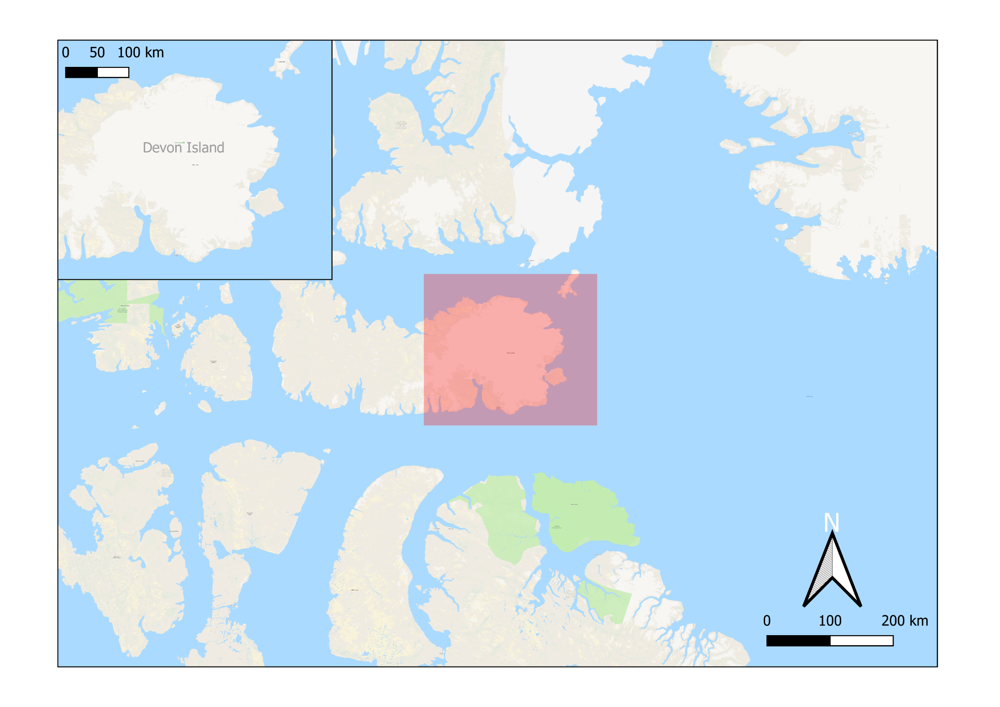
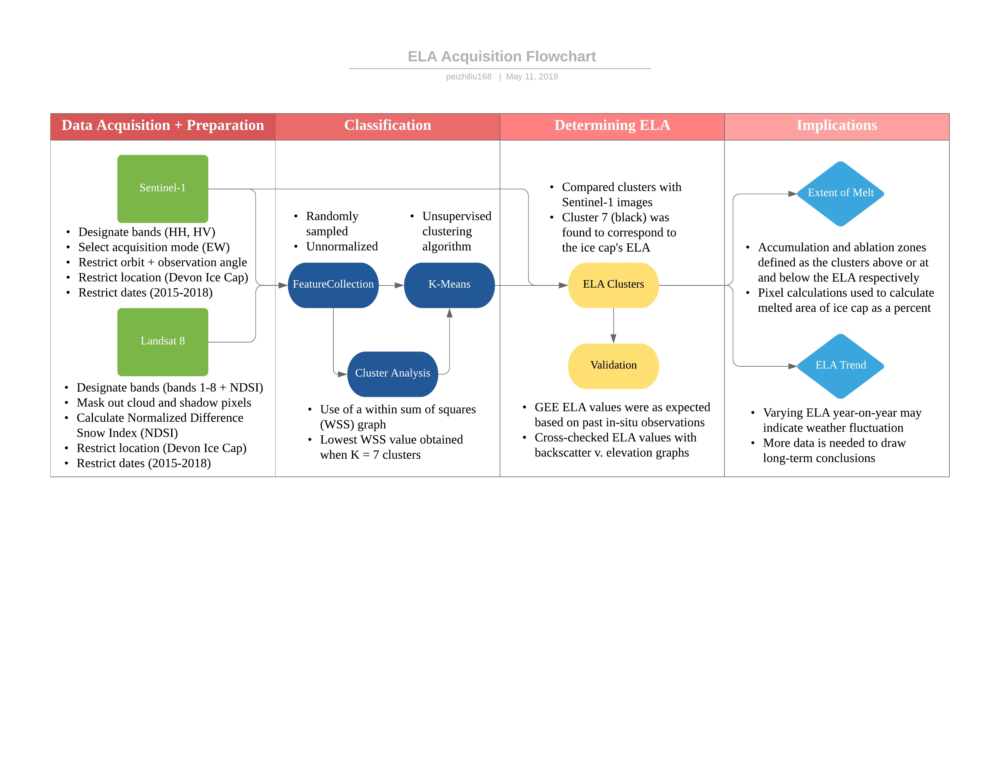
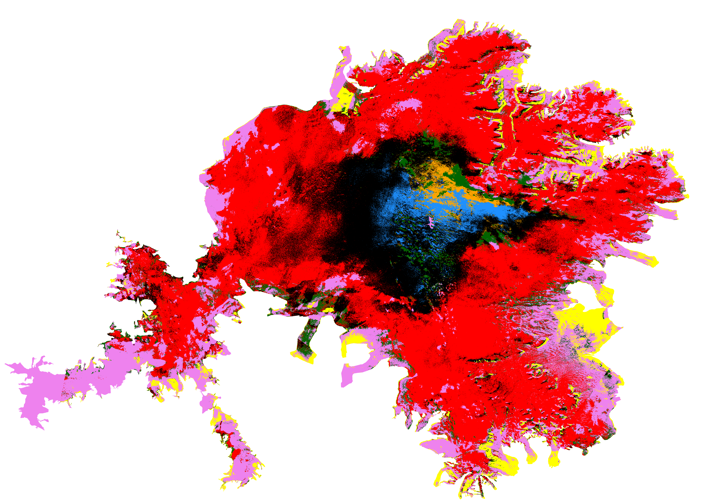
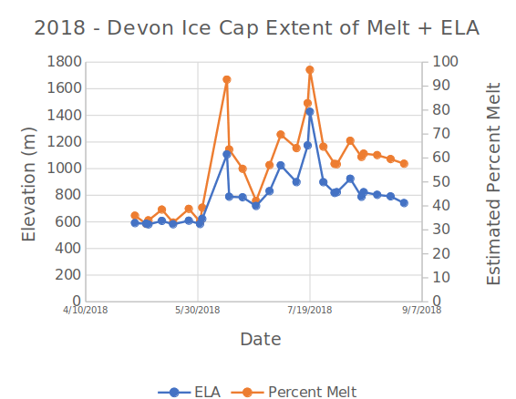

# Utilizing Google Earth Engine to Retrieve the Devon Ice Cap’s Equilibrium Line Altitude​

   

  

## Description
Worked with Kevin Zhou and Dr. Grant Gunn, assistant professor in the Department of Geography, Environment and Spatial Sciences at Michigan State University, to determine the Equilibrium Line Altitude of the Devon Ice Cap using Sentinel-1 satellite imagery. The Satellite imagery was then processed and clustered using Google Earth Engine. Additional processing and analysis were done using QGIS and Python scripts. Further information about our research and ISEF posters can be found on the GitHub page. An interview with Michigan State University can be found in this link: https://www.wkar.org/post/msu-professor-and-troy-high-school-students-collaboration-leads-award-winning-climate-research#stream/0